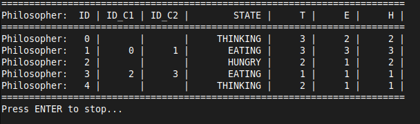

# Systemy Operacyjne 2

## Problem jedzących filozofów

### Opis

Problem jedzących filozofów( Dining Philosophers Problem ) jest problemem używanym do demostracj problemów synchronizacji w programowaniu wielowątkowym.
Zazwyczaj problem przedstawiany jest tak:\
Przy stole siedzi 5 filozofów. Każdy filozof ma przy sobie dwie pałeczki (czasami widelce, ale pałeczki mają dla mnie więcej sensu), którymi dzieli się ze swoimi sąsiadami.
Filozofowie mogą jeść lub rozmyślać. Żeby jeść filozof potrzebuje obu leżących przy nim pałeczek.
Po podniesieniu pałeczek filozof je przez jakiś skończony czas. Następnie odkłada pałeczki i zaczyna rozmyślać także przez skończony czas.\
\
[Rys 1](https://en.wikipedia.org/wiki/Dining_philosophers_problem#/media/File:Dining_philosophers_diagram.jpg) Przykładowa wizualizacja

### Założenia

1. Filozof potrzebuje dwóch pałeczek do jedzenia.
2. Pałeczka może być trzymana przez jednego filozofa na raz.
3. Filozof może podnieść tylko pałeczki bezpośrednio przy nim. (Np. Filozof i może podnieść pałeczki i-1,i)
4. Po jakimś czasie (symulującym jedzenie) filozof musi odłożyć pałeczkę.
5. Filozof może być w trzech stanach Rozważa(THINKING), Je(EATING) i Czeka(HUNGRY).

### Wątki i sekcje krytyczne

Każdy filozof w programie symulowany jest na osobnym wątku.

W programie występują dwie sekcje krytyczne: \

1. Wynika z treści zadania. Kiedy filozof podnosi pałeczki musi je zablokować by nie doszło do wyścigu. \
     \
    Powyższy kod przedstawia fragment funkcji takeChop w której filozof podnosi pałeczki.
    W tym przypadku wygodniej było użyć funkcji std::mutex.lock()
    W pętli while filozof(wątek) próbuje podnieść prawą pałeczkę.
    Jeżeli mu się nie uda odkłada lewą i czeka chwilę. \
     \
    Powyższy kod przedstawia fragment funkcji putChop która odpowiada za odkładanie pałeczek.
    Jako że wcześcniej użyto std::mutex.lock() to w dalszej części kodu musi pojawić się std::mutex.unlock().

2. Nie jest ściśle niezbędna ale użyto jej by wydruk był bardziej przejrzysty.\
     \
    W tej sekcji kodu użyto std::lock_guard\<mutex\> jest to klasa otaczająca mutex.
    Podczas tworzenia wywoływany jest std::mutex.lock() na podanym mutexsie.
    Natomiast przy wywołaniu dekonstruktora (Np. po wyjściu z zakresu) używana jest funkcja std::mutex.unlock().

## Instrukcja

1. Kod przygotowany na systemy Linux (korzysta z biblioteki pthreads).
2. Gotowy plik wykonywalny znajduję się w katalogu build/release/ pod nazwą Proj_1.
3. Do całego projektu załączony jest CMakeLists.txt.
4. Aby zkompilować kod do pliku wykonywalnego należ użyć komend:

        cmake -S . -B build/release -G "Unix Makefiles"
        cmake --build build/release
    *"Unix Makefiles" można zastąpić innym generatorem.

5. Przy uruchamianiu programu należy podać argument typu int będący liczbą filozofów. Np:

        ./Proj_1 5

    Uruchomiony zostanie program obsługujący 5 filozofów.

### Wydruk w konsoli

\
Powyżej zamieszczam przykład tego jak będzie wyglądał wydruk w konsoli.
Każdy filozof ma przypisane własne id.
W kolumnach ID_C1 i ID_C2 znajdują się id pałeczek które trzyma filozof (Jeżeli nie trzyma żadnej to pola zostają puste).
Kolumna STATE wskazuje aktualny stan danego filozofa.
Kolumny T,E i H wskazują odpowiednio ile razy filozof znalazł się w stanie THINKING, EATING oraz HUNGRY.

## Źródła

1. <https://www.geeksforgeeks.org/dining-philosopher-problem-using-semaphores/>
2. <https://lass.cs.umass.edu/~shenoy/courses/spring04/677/readings/Chandy_drinking_phil.pdf>
3. <https://enomem.substack.com/p/the-drinking-philosophers-problem>
4. <https://www.geeksforgeeks.org/dining-philosophers-problem/>
5. <https://www.youtube.com/watch?v=-Qa1RqmXKG0>
6. <https://www.youtube.com/watch?v=Zp17-UDKM90>
7. <https://www.youtube.com/watch?v=hXKtYRleQd8>
